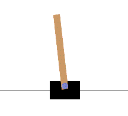
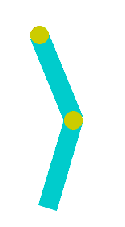
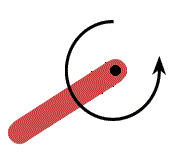
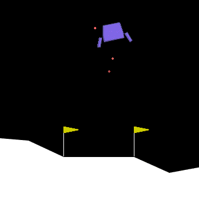
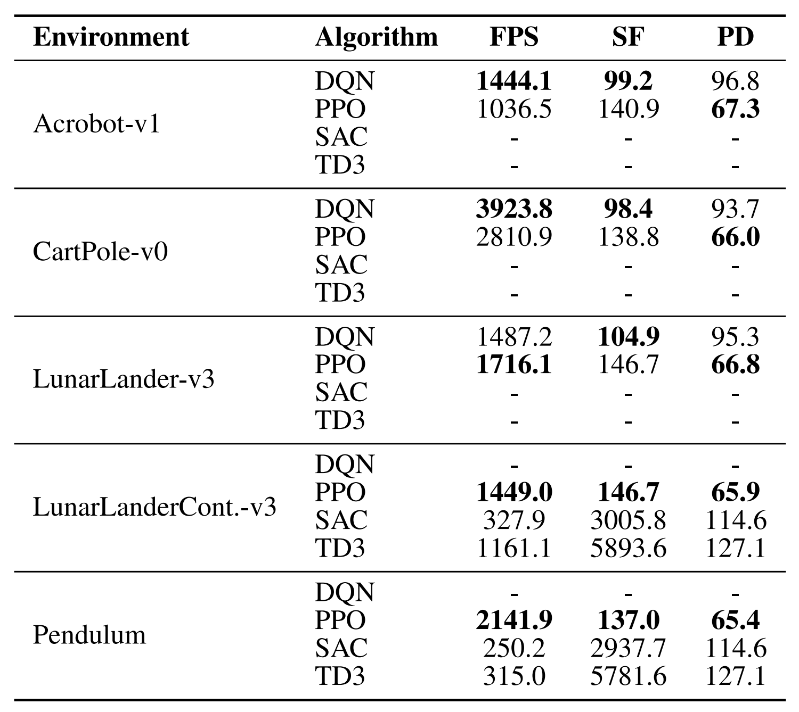

# A Comparative Study of Deep Reinforcement Learning Algorithms: DQN, PPO, SAC and TD3


The current repository was created within the scope of a project during the course [EE-568 Reinforcement Learning](https://edu.epfl.ch/coursebook/en/reinforcement-learning-EE-568) at [EPFL](https://www.epfl.ch/en/).

The authors of the repository are:
 
- Camille Challier
- Céline Kalbermatten
- Wesley Monteith-Finas
- Luca Mouchel
- Elia Mounier-Poulat
- Colin Smyth 

Together they form the group **RLSquad: Gradient Descent into Chaos**. 😊

## Table of contents:

- [Abstract](#abstract)
- [Introduction](#introduction)
- [Setup](#setup)
- [Repository structure](#repository-structure)
- [Approach](#approach)
- [Results](#results)
- [Conclusion](#conclusion)


## Abstract
Over the past decade, deep learning has significantly advanced Reinforcement Learning (RL), enabling solutions to increasingly complex tasks through neural network-based policies. In this project, we systematically evaluated and compared four popular deep RL algorithms: DQN, PPO, TD3 and SAC, across a range of discrete and continuous control environments. Our study focused on their efficiency in terms of convergence speed, training stability and policy storage requirements. We found that PPO offers a strong balance between computational speed and memory efficiency across both action space types, while SAC and TD3 achieved superior performance on continuous control tasks at the expense of higher computational cost. These insights provide practical guidance for selecting RL algorithms based on resource constraints and task complexity.


## Introduction
### Algorithms 
In this project, we focused on four well-known algorithms that are often used in research and applications: DQN, PPO, SAC and TD3. Each of these algorithms follows a different approach and comes with its own strengths and limitations.

**Deep Q-Newwork (DQN)** 🤖🧠 <br> 
Deep Q-Network (DQN) is a value-based, off-policy algorithm introduced by Mnih et al. (2015). It learns a Q-function $Q(s, a; \theta)$ using a neural network to approximate the expected return of taking action $a$ in state $s$. The Q-network is trained by minimising a sequence of loss functions $L_i(\theta_i)$ that changes at each iteration $i$:

$$L_i(\theta_i) = \mathbb{E}_{s, a \sim \rho(\cdot)} \left[ \left( y_i - Q(s, a; \theta_i) \right)^2 \right]$$

where $y_i = \mathbb{E} [r + \gamma \max_{a'} Q(s', a'; \theta_{i-1}) | s, a]$ is the target for iteration $i$ and $\rho(s, a)$ is a probability distribution over sequences $s$ and actions $a$, referred to as the behaviour distribution. The parameters from the previous iteration $\theta_{i-1}$ are held fixed when optimising the loss function $L_i(\theta_i)$. 


**Proximal Policy Optimisation (PPO)** 🎯🧭 <br> 
Proximal Policy Optimization (PPO), proposed by Schulman et al. (2017), is an on-policy policy gradient method. It directly optimizes a stochastic policy $\pi_\theta(a | s)$ using a surrogate objective that prevents the new policy from deviating too far from the old one. The main objective is:

$$L^{\text{CLIP}}(\theta) = \mathbb{\hat{E}}_t \left[\min \left(r_t(\theta) \hat{A}_t,\\text{clip} (r_t(\theta), \ 1 - \epsilon,\ 1 + \epsilon) \hat{A}_t\right)\right]$$

where $r_t(\theta) = \frac{\pi_\theta(a_t | s_t)}{\pi_{\theta_{\text{old}}}(a_t | s_t)}$ is the probability ratio, $\hat{A}_t$ is the estimated advantage, and $\epsilon$ is a hyperparameter, typically set to 0.2. The motivation behind this clipped objective is to prevent too large updates to the policy. The clipping ensures that if the probability ratio $r_t$ goes outside the interval $[1 - \epsilon, 1 + \epsilon]$, the advantage is not amplified. By taking the minimum between the clipped and unclipped terms, the objective provides a pessimistic (lower-bound) estimate of the true surrogate loss. Harmful updates do not happen while the learning progress is still ensured. PPO is known for being stable and relatively easy to implement. It can be used in both discrete and continuous environments and is widely used as a reliable baseline in research.

**Soft Actor Critic (SAC)** ❄️🎬 <br> 
Soft Actor-Critic (SAC), introduced by Haarnoja et al. (2018), is an off-policy actor-critic algorithm designed for continuous control tasks. It not only tries to maximise the expected reward but also encourages exploration by adding an entropy term to the objective. The Q-function parameters $\theta$ are trained to minimize the soft Bellman residual:

$$J_Q(\theta) = E_{(s_t, a_t) \sim D} [ (1/2) ( Q_\theta(s_t, a_t) - \hat{Q}(s_t, a_t) )^2 ]$$

where the target $\hat{Q}(s_t, a_t) = r(s_t, a_t) + \gamma\, E_{s_{t+1} \sim p} [ V_{\bar{\psi}}(s_{t+1}) ]$ includes a slowly updated value network. SAC uses two Q-networks to reduce overestimation and is highly sample-efficient and robust across different tasks.

**Twin Delayed Deep Deterministic Policy Gradient (TD3)** 🧬⏱ <br> 
Twin Delayed Deep Deterministic Policy Gradient (TD3), developed by Fujimoto et al. (2018), is another off-policy actor-critic method for continuous action spaces. It builds on the Deep Deterministic Policy Gradient (DDPG) algorithm, which is a deterministic actor-critic method for continuous control, but improves it by addressing issues like overestimation bias and instability. TD3 also uses two Q-networks (like SAC). The target for the Q-function update is computed as:

$$y = r + \gamma \min_{i=1,2} Q_{\theta_i'}\left(s', \pi_{\phi}(s')\right)$$

where $\theta_i'$ are the parameters of the two target Q-networks, and $\pi_{\phi'}$ is a slowly updated target actor network. The use of the minimum of the two critics helps reduce overestimation of the Q-values. To improve stability, TD3 adds clipped noise to the target actions (target policy smoothing) and delays actor updates relative to the critic. These techniques help reduce overestimation and make learning more reliable in continuous control tasks. 

### Environments
We used several different Gymnasium environments to test and compare the performance of the implemented algorithms. These environments vary in terms of dynamics, action space and difficulty.

**Cartpole** 🎡⚖️ <br> 
In the Cartpole environment, the goal is to balance a pole upright on a moving cart by applying forces to the left or right. The agent must prevent the pole from falling over for as long as possible. It is a classic control problem with a discrete action space.

**Acrobot** 🤸‍♂️🔗 <br> 
The Acrobot environment consists of two links connected linearly to form a chain, with one end of the chain fixed. The joint between the two links is actuated. The goal is to swing the end of the lower link up to a target height. The environment has a continuous state space and a discrete action space, making it a challenging control task. 

**Pendulum** 🕰️🔁 <br> 
The Pendulum environment consists of a pendulum attached at one end to a fixed point, and the other end being free. The pendulum starts in a random position and the goal is to apply torque on the free end to swing it into an upright position, with its center of gravity right above the fixed point. The action space is continuous.

**Lunar Lander** 🚀🌕 <br> 
The Lunar Lander environment is a classic rocket trajectory optimisation problem. It simulates a spacecraft landing between two flags on the moon's surface. The agent controls the lander's main and side thrusters to achieve a soft landing. It includes both discrete and continuous versions and provides a good test for both stability and precision in control. 

<p align="center">
  <table style="font-size: 12px;">
    <tr>
      <td align="center">
        <br>
        <sub>CartPole</sub>
      </td>
      <td align="center">
        <br>
        <sub>Acrobot</sub>
      </td>
      <td align="center">
        <br>
        <sub>Pendulum</sub>
      </td>
      <td align="center">
        <br>
        <sub>Lunar Lander</sub>
      </td>
    </tr>
  </table>
</p>

## Setup

### Pre-requisites

- [Python](https://www.python.org/downloads/)
- [Numpy](https://numpy.org/)
- [Pandas](https://pypi.org/project/pandas/)
- [Matplotlib](https://matplotlib.org/stable/install/index.html)
- [tqdm](https://pypi.org/project/tqdm/)
- [PyTorch](https://pypi.org/project/torch/)
- [Gymnasium](https://pypi.org/project/gymnasium/)
- [Stable-Baselines3](https://pypi.org/project/stable-baselines3/)
- [Tensorboard](https://pypi.org/project/tensorboard/)

**`requirements.txt`** is provided to install the necessary Python dependencies.

```sh
pip install -r requirements.txt
```

## Repository structure
The repository is structured the following way:

```
Deep_RL/
├── illustrations/                   # Directory containing the illustrations of the different environments
├── results/                         # Directory containing all the obtained plots and tables
├── results_data/                    # Directory containing all pickle files per environment
├── analysis.ipynb                   # Jupyter notebook used to analyse the training speed, storage footprint and parameter density per algorithm
├── plot.py                          # Script to plot performance data from multiple algorithms on a given environment
├── requirements.txt/                # File containing all requirements to run the current project
├── run_multiseed.py                 # Script to train and evaluate the algorithms on the environments using several random seeds
```

## Approach
We evaluated and compared the four introduced deep reinforcement learning algorithms - DQN, PPO, SAC and TD3 - on the different environments, covering both discrete and continuous action spaces. Each algorithm was implemented using Stable Baselines3, with experiments run over three random seeds for reproducibility. We used Mlp Policy networks and evaluated models at regular intervals during training based on average episode rewards.

In total, we ran twelve experiments, selecting algorithm-environment pairs based on action space compatibility. For discrete environments (Cartpole, Acrobot and Discrete Lunar Lander), we tested DQN and PPO. For continuous environments (Pendulum and Continuous Lunar Lander), we tested PPO, SAC and TD3.

The training lengths varied per environment (for example 20,000–200,000 timesteps) and the results were evaluated using metrics such as mean reward, training speed (FPS), storage footprint and parameter density. We visualised the learning progress with mean ± standard deviation reward curves and the key results are discussed in the report and shown in figures 1 and 2 and table 1.


## Results
The following plots visualise the training performance of the evaluated algorithms on the environments.

<div align="center">    </div>
<p align="center">
  <strong>Figure 1:</strong> Comparison of PPO and DQN on discrete environments: (a) Cartpole, (b) Acrobot and (c) Discrete Lunar Lander
</p>

<div align="center">   </div>
<p align="center">
  <strong>Figure 2:</strong> Comparison of PPO, TD3 and SAC on continuous environments: (a) Continuous Lunar Lander and (b) Pendulum
</p>

The following table summarises the computational aspects such as training speed (measured in frames per second), storage footprint (in kilobytes) and parameter density (parameters per kilobyte) for each algorithm-environment pair.

<p align="center">
  
</p>
<p align="center">
  <strong>Table 1:</strong> Comparison of training speed (FPS), storage footprint (SF) and parameter density (PD) across the algorithms and environments.
</p>

## Conclusion

In discrete environments such as Cartpole and Acrobot, PPO consistently exhibited faster convergence and superior final performance compared to DQN. Additionally, PPO maintains a favorable balance between training speed and parameter density. This makes it well-suited for simpler state-action spaces, discrete control tasks and scenarios requiring rapid prototyping with limited computational resources. However, the advantages of PPO diminish in continuous control tasks. In environments such as Pendulum, PPO struggled to reach optimal performance and showed high variability throughout training. In contrast, SAC consistently outperformed PPO on Pendulum and Continuous Lunar Lander. This is due to its off-policy actor-critic framework tailored for continuous action spaces. It demonstrated more stable learning curves and achieved higher final rewards. However, this improved performance comes at a computational cost. SAC and TD3 require substantially more memory and exhibit slower training speeds. These trade-offs highlight the importance of algorithm selection based on the target application. SAC works well for complex continuous control tasks when plenty of computing power is available.
